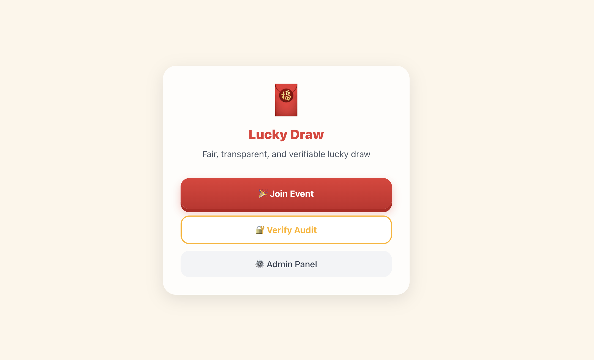
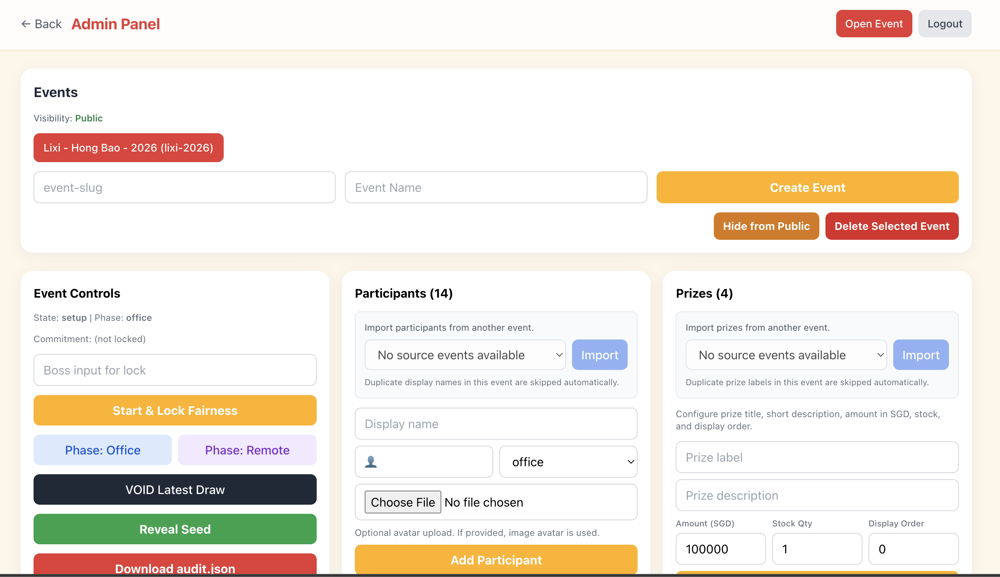
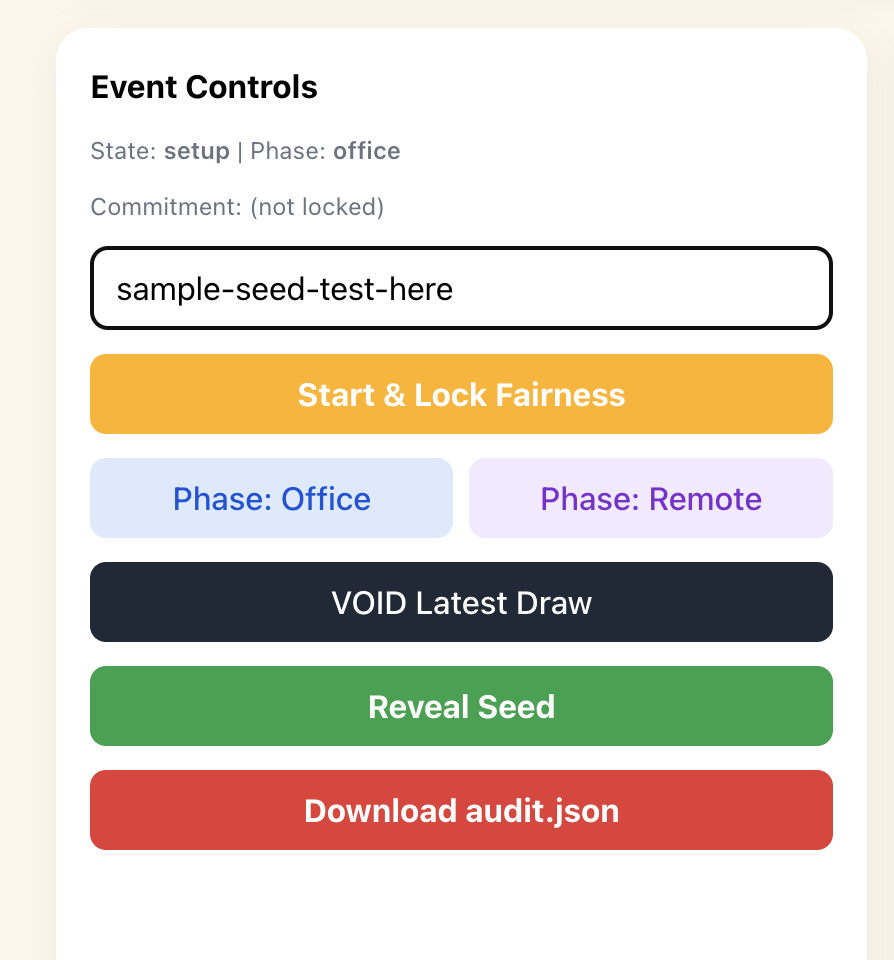
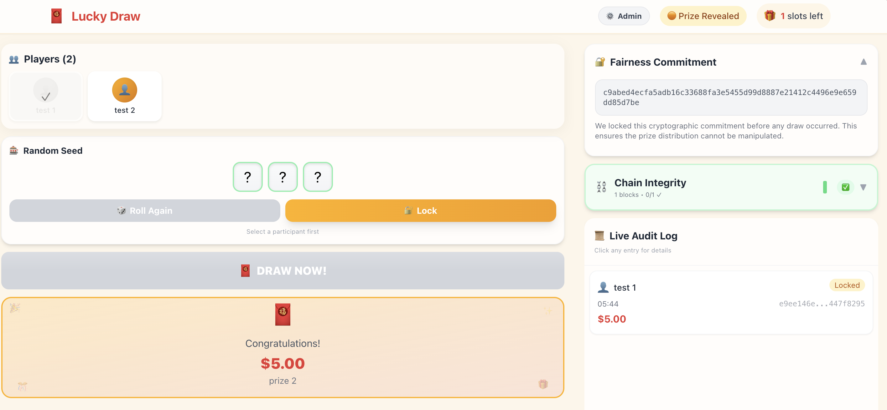
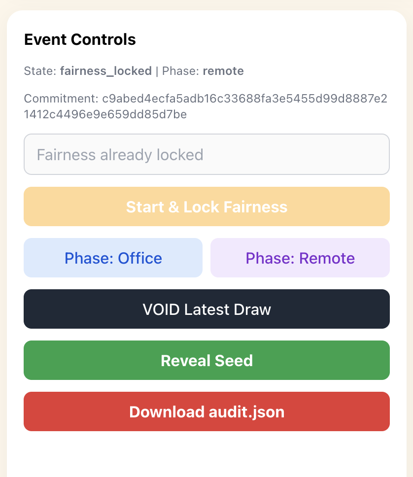
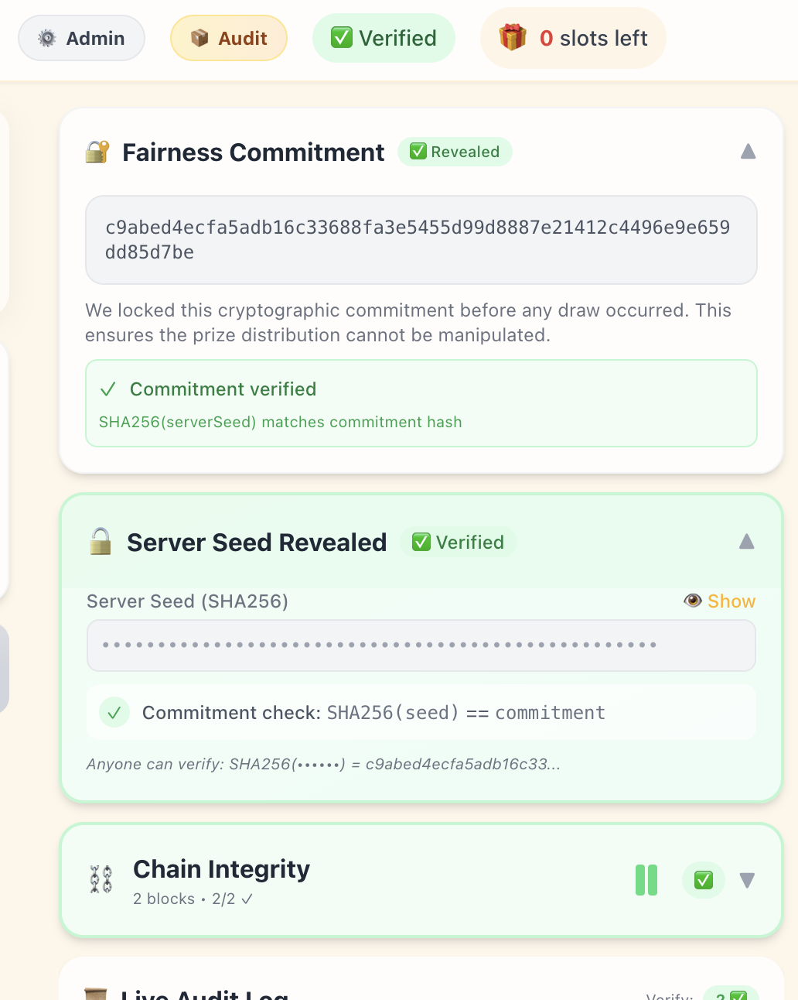
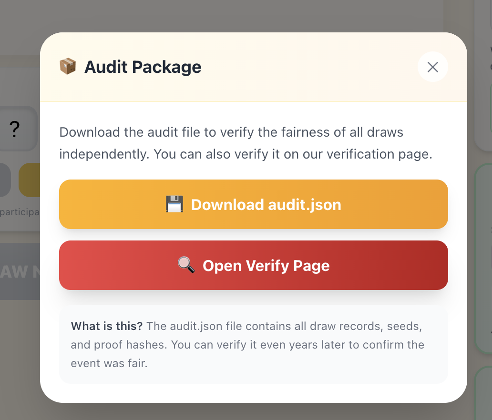

# Lì Xì Genie User Guide (Admin and Remote User)

## Scope
This guide covers live lucky-draw event operation and post-event fairness verification in Lì Xì Genie.

Audience:
- `Admin`
- `Remote User`

---

## Quick Role Matrix

Admin can:
- Sign in to `/admin`
- Create/select events
- Show or hide event visibility to public users
- Manage participants and prizes
- Start and lock fairness
- Switch event phase (`office` / `remote`)
- Run draws from the live event page
- VOID latest draw
- Reveal server seed
- Download `audit.json`

Remote user can:
- Join public events from `/`
- Participate in draw flow on `/event/{slug}`
- View transparency panels (commitment, chain, audit log)
- Verify event fairness after reveal on `/verify`

Remote user cannot:
- Access admin-only operations
- Access hidden events (events not marked public)

---

## Before You Start (Admin)

### Prerequisites Checklist
- You have a valid admin passcode.
- Event exists (created in `/admin`).
- Participants are added with correct participation mode (`office` or `remote`).
- Prize stock is configured.
- Event visibility is set to public when remote users need to join.

### Known Constraints
- `Start & Lock Fairness` works only once while event state is `setup`.
- `Reveal Seed` requires all required draws to be completed; otherwise reveal may fail.
- `audit.json` download requires seed reveal first.

---

## Admin Guide (Step-by-Step)

### 4.1 Sign In and Session
1. Open `/admin`.
2. Enter passcode.
3. Click `Sign In`.
4. If you see session-expired behavior, sign in again (admin session uses a signed `httpOnly` cookie with expiry).

### 4.2 Create and Select Event
1. In `Events`, enter:
   - `event-slug`
   - `Event Name`
2. Click `Create Event`.
3. Click the event chip to select it.
4. Click `Open Event` to open `/event/{slug}`.

### 4.3 Control Event Visibility
1. In `Events`, use:
   - `Show to Public` to make event joinable from home page
   - `Hide from Public` to remove event from public list
2. Hidden events do not appear in `/api/events` and are not joinable by remote users.

### 4.4 Manage Participants
1. Add participant:
   - Enter `Display name`
   - Choose emoji avatar or upload image avatar
   - Set `participation mode` (`office` or `remote`)
   - Click `Add Participant`
2. Import participants:
   - Select source event in import dropdown
   - Click `Import`
   - Duplicate display names in current event are skipped automatically
3. Edit participant:
   - Click `Edit`
   - Update display name, avatar type/value, participation mode, `Draw enabled`, sort order
   - Click `Save`
4. Remove participant:
   - Click `Remove`

### 4.5 Manage Prizes
1. Add prize:
   - Fill `Prize label`, optional description
   - Fill `Amount (SGD)`, `Stock Qty`, `Display Order`
   - Click `Add Prize`
2. Import prizes:
   - Select source event in import dropdown
   - Click `Import`
   - Duplicate prize labels in current event are skipped automatically
3. Remove prize:
   - Click `Remove`
4. Stock behavior:
   - Successful draw decrements remaining stock.
   - `VOID Latest Draw` restores stock for the latest effective draw.

### 4.6 Lock Fairness and Start Event
1. In `Event Controls`, enter boss input in `Boss input for lock`.
2. Click `Start & Lock Fairness`.
3. Confirm commitment hash is shown in UI.
4. Fairness meaning:
   - Commitment is fixed before draws.
   - Server seed is revealed later for independent verification.

### 4.7 Run Draws (Live Event Page)
1. Click Open Event Btn on top right
2. Select a participant card.
3. Click `Roll`, then `Lock` in the seed panel.
4. Click `DRAW NOW!`.
5. Confirm:
   - Prize appears in reveal panel
   - New record appears in `Live Audit Log`
6. Repeat for each participant.

Phase rule:
- If participant mode does not match current event phase, selection/draw is blocked with an error.
- Switch phase in admin using:
  - `Phase: Office`
  - `Phase: Remote`
- Retry draw after phase change.

### 4.8 Correct Mistakes
1. In admin `Event Controls`, click `VOID Latest Draw`.
2. Expected outcome:
   - Append-only VOID record remains in audit log.
   - Prize stock is restored.
   - Event remains auditable and transparent.

### 4.9 Reveal and Publish Verification
1. After draw completion, click `Reveal Seed`.
2. Expected outcome:
   - Event moves to revealed/completed verification state.
   - Verification summary is populated.
   - `Audit` button appears in event header.
3. Download `audit.json`:
   - From admin: `/api/events/{slug}/audit.json`
   - Or from event header `Audit` dialog
4. Share verification route with users: `/verify`.

### 4.10 End of Event Checklist
- Seed reveal completed.
- `audit.json` downloaded and archived.
- Audit verification run on `/verify`.
- Optional: hide event from public after event closure.

---

## Remote User Guide (Step-by-Step)

### 5.1 Join Event
1. Open `/`.
2. Click `Join Event`.
3. Select event from modal list.
4. If your event is missing, contact admin to set event visibility to public.

### 5.2 Participate in Draw
1. On `/event/{slug}`, find your name card.
2. Click your card.
3. Click `Roll` (you may re-roll), then click `Lock`.
4. Click `DRAW NOW!`.
5. Check your result in the prize reveal panel.

If blocked:
- `Select a participant first` means no player is selected.
- Participant mode mismatch error means admin must switch event phase (`office`/`remote`).
- Disabled/grayed player cards indicate already drawn participants.

### 5.3 Understand Transparency Panels
- `Fairness Commitment`: public cryptographic commitment locked before draw.
- `Chain Integrity`: shows whether draw hash chain is intact.
- `Live Audit Log`: shows draw records and statuses (`Locked`, `Verified`, `VOID`) with proof hash preview.

### 5.4 Verify After Reveal
1. After reveal, click `Audit` in event header.
2. Download `audit.json`.
3. Open `/verify`.
4. Upload file and click `Run Verification`.
5. Interpret results:
   - Commitment: `PASS` / `FAIL`
   - Chain: `PASS` / `FAIL`
   - Per-draw verification results and summary totals

---

## Troubleshooting (Admin and Remote User)

### Authentication
- `Invalid admin passcode`:
  - Re-enter correct passcode.
  - Check environment value for `ADMIN_PASSCODE` in deployment.
- `Admin session expired`:
  - Sign in again at `/admin`.

### Draw and Event Lifecycle Errors
- `[state_not_locked]`:
  - Run `Start & Lock Fairness` first.
- `[phase_blocked]`:
  - Participant mode does not match event phase; switch phase and retry.
- `[participant_already_drawn]`:
  - Participant has already completed an effective draw.
- `[no_prize_stock]`:
  - No remaining prize stock; add/adjust prizes if needed (admin).
- `[rate_limited]`:
  - Too many requests in a short time; wait and retry.
- `[draws_incomplete]` when revealing:
  - Complete required draws before `Reveal Seed`.

### Audit and Verification
- `[seed_not_revealed]` on audit download:
  - Reveal seed first.
- Event missing from join modal:
  - Admin must set `Show to Public`.
- `Invalid JSON file` on `/verify`:
  - Ensure uploaded file is valid `audit.json`.
- Verification FAIL:
  - Re-download source `audit.json` and re-run verification.
  - If still failing, escalate to admin and preserve the exact file used.

---

## Quick Steps (Copy/Paste)

### Admin Quick Runbook (10 lines)
1. Open `/admin` and sign in.
2. Create/select event.
3. Add/import participants with correct `office`/`remote` mode.
4. Add/import prizes and confirm stock.
5. Ensure event is public (`Show to Public`) when remote users should join.
6. Enter boss input and click `Start & Lock Fairness`.
7. Open `/event/{slug}` and run draws (`Select` -> `Roll` -> `Lock` -> `DRAW NOW!`).
8. Switch phase (`Office`/`Remote`) when mode mismatch occurs.
9. Use `VOID Latest Draw` for mistaken draw if needed.
10. Click `Reveal Seed`, download `audit.json`, and verify on `/verify`.

### Remote User Quick Flow (6 lines)
1. Open `/` and click `Join Event`.
2. Choose your event.
3. Select your player card.
4. Click `Roll`, then `Lock`.
5. Click `DRAW NOW!` and view result.
6. After reveal, download `audit.json` and verify on `/verify`.

---

## API/Interface Impact
- No API, type, or interface changes were made.
- This is documentation-only.
- Referenced routes: `/admin`, `/event/{slug}`, `/verify`, `/api/events`, `/api/events/{slug}/audit.json`.

---

## Validation Scenarios for This Guide
1. Fresh event flow from admin sign-in to first successful draw.
2. Remote-phase mismatch and recovery by phase switch.
3. Mistaken draw -> `VOID Latest Draw` -> redraw.
4. Hidden event not visible in Join modal, then visible after `Show to Public`.
5. Reveal attempted before completion (expected failure), then successful reveal after completion.
6. Post-reveal `audit.json` download and successful verification on `/verify`.
7. Session-expiry path requiring admin re-login.

---

## Assumptions and Defaults
- Language: English.
- Format: single guide with Admin and Remote User sections.
- Depth: step-by-step with troubleshooting.
- No screenshots included.
- Instructions are based on current implemented routes and UI labels.
